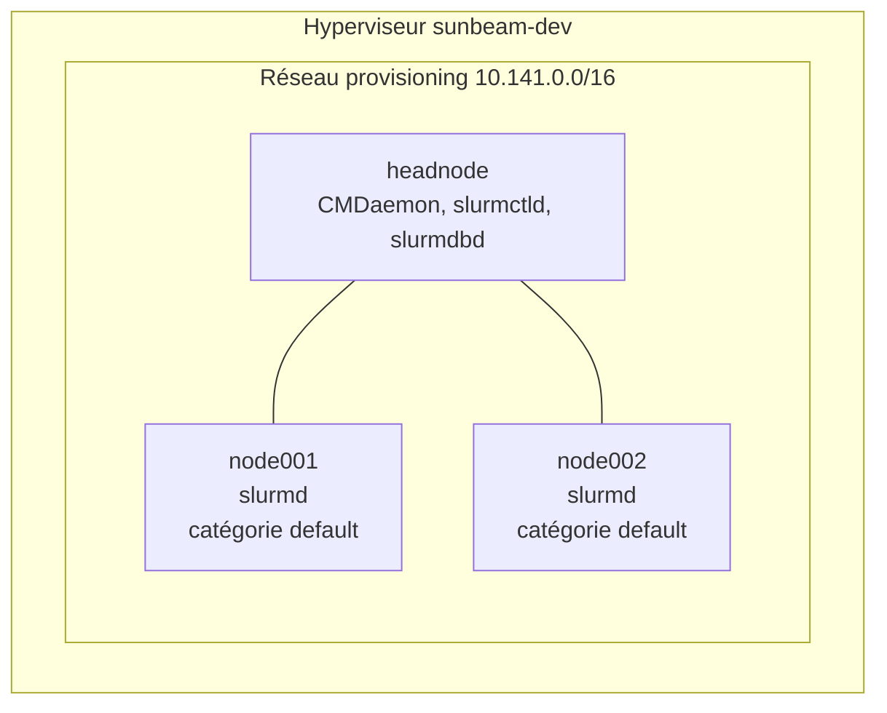

```mermaid
flowchart TB
  subgraph HOTE["Hyperviseur sunbeam-dev"]
    subgraph NET1["Réseau provisioning 10.141.0.0/16"]
      H["headnode<br/>CMDaemon, slurmctld, slurmdbd"]
      N1["node001<br/>slurmd<br/>catégorie default"]
      N2["node002<br/>slurmd<br/>catégorie default"]
    end
  end
  H --- N1
  H --- N2
```
